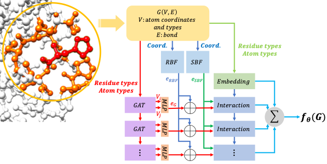

<div align="center">

# SE(3) Equivalent Graph Attention Network as an Energy-Based Model for Protein Side Chain Conformation



</div>

## Description

A graph attention network as an energy-based model for protein conformation.

## First time setup

The following step is required in order to implement GraphEBM:

### Dependencies

To install the dependencies for the project, execute

```
conda env create -f environment.yaml
```

### Datasets

Following the https://github.com/facebookresearch/protein-ebm#downloading-the-datasets and
https://github.com/facebookresearch/protein-ebm#preprocessing to get the datasets.


## Training

The following script will train a model:

```
python train.py \
--model DimeNetPlusPlusGraph \
--max-distance 20.0 \
--neg-sample 3 \
--multisample 16 \
--n-epochs 2 \
--gmm \
--uniform \
--no-augment \
--gpus 1 \
--nodes 1 \
--batch-size 16 \
--nodes 1 \
--data-workers 0 \
--exp DimeNetPlusPlusGraph3Sample20DistSmooth0.75 \
--log-interval 50 \
--save-interval 2000 \
--resume-iter 0 \
--smooth_factor 0.75 \
--no-restrict
```

In our paper, we trained models on a RTX3090.

## Test

To reproduce the results shown in our paper, run

```
# Discrete sampling strategy
python vis_sandbox.py \
--exp=DimeNetPlusPlusGraph3Sample20DistSmooth0.75 \
--resume-iter=24000 \
--task=rotamer_trial \
--sample-mode=gmm \
--neg-sample=150

# Countiuous sampling strategy
python vis_sandbox.py \
--exp=DimeNetPlusPlusGraph3Sample20DistSmooth0.75 \
--resume-iter=24000 \
--task=rotamer_trial \
--sample-mode=rosetta \
--neg-sample=500
```
In our paper, the trained model has been uploaded in https://drive.google.com/file/d/1nhJL0Cj53BmK5dRJqXSkKn-klBuvh2v2/view?usp=sharing.
You can download it and put it in cachedir/DimeNetPlusPlusGraph3Sample20DistSmooth0.75.

## Citing this work

If you find the GraphEBM useful, please cite:

```bibtex
@article {Liu2022.09.05.506704,
	author = {Liu, Deqin and Chen, Sheng and Zheng, Shuangjia and Zhang, Sen and Yang, Yuedong},
	title = {SE(3) Equivalent Graph Attention Network as an Energy-Based Model for Protein Side Chain Conformation},
	elocation-id = {2022.09.05.506704},
	year = {2022},
	doi = {10.1101/2022.09.05.506704},
	publisher = {Cold Spring Harbor Laboratory},
	URL = {https://www.biorxiv.org/content/early/2022/09/06/2022.09.05.506704},
	eprint = {https://www.biorxiv.org/content/early/2022/09/06/2022.09.05.506704.full.pdf},
	journal = {bioRxiv}
}
```
